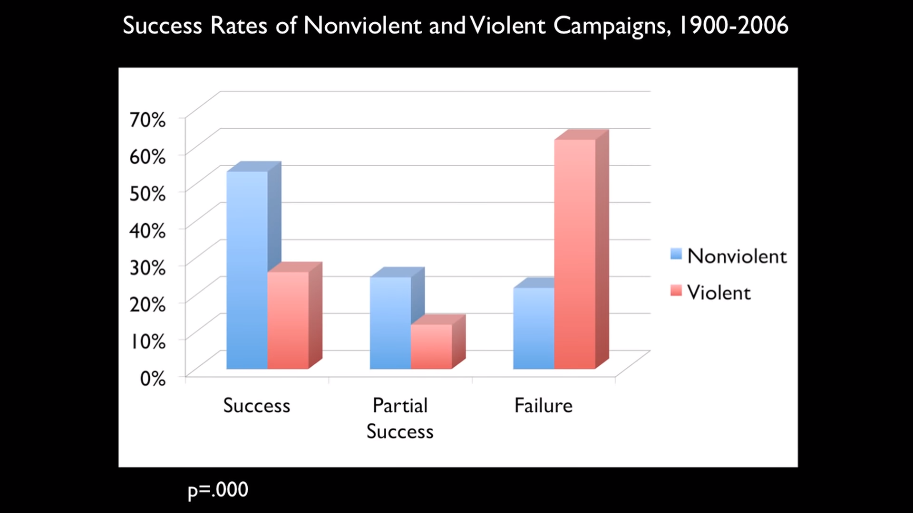
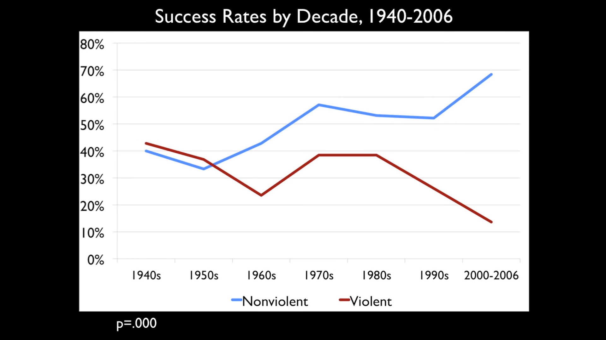

# Why Civil Disobedience Works

src: [Ted Talk](https://www.youtube.com/watch?v=YJSehRlU34w)

## Main Points

1. What would be the best way to challenge and create something new?
2. Mass non-cooperation campaigns to seek change:

    - Serbia - Oct 2010
    - The Philippines People Power Movement - 1986

3. All major nonviolent and violent campaigns from 1900-2006

    - Data covers entire world
    - Include every known case with at least 1000 observed participants

The nonviolent campaigns are **twice** as likely to succeed as violent ones. This trend has been increasing:

The nonviolents campaigns are increasingly more successful and common, and violent ones are increasingly rare and unsuccessful.

**This is true even in extremely authoritarian conditions.**

## Why is Civil Resistence so Effective?

It lies in People Power.

**No single campaign failed during 1900-2006, where there is *active and sustained* participation of just `3.5%` of the population.**

---
*side note*: Total population of Myanmar according to [worldometers.info](https://www.worldometers.info/world-population/myanmar-population/) in 2020 is 54,409,800 (54.4 million).  `3.5%` of that is 

> 1.9 Million

***TODO: How many People are protesting?***

---

## Points for Nonviolent Campaigns

- Everyone single campaign that surpassed that percentage is a nonviolent one.
- Size of nonviolent campaigns are 4 times larger than violent ones.
- They are more inclusive, in terms of age, gender, disability, etc. Violent resistence is more physically demanding and it's more hard to involve.
- The visibility of civil resistance action attracts people who are unsure of involvement. When they become involved, people from security forces, civilian bureaucrats and economic and business elites, education and media, religious authorities and so on. Those people start to reevaluate their own allegiances. 
- Regime don't live in isolation, they are related to the people in the protests.
    - In Serbia, police officers disobeyed the order to shoot the demonstrators.
    - "I knew by kids would be in the crowd."

## Tactics
- Go from concentration to dispersion, where people stay away from places there were expected to go.
- Strikes, pots and pans, stay at home, shut off their electricity at coordinated time of day
- Very hard or costly to suppress but the movement stays just as disruptive

## Aftermath
- Nonviolent victories are more likely to form democratic government compared to violent victories.
- Nonviolent victories were 15% less likely to relapse into civil war.

## Summary
- Civil Resistence -> Size Grow
- Large Number of People Remove Themselves from Cooperation -> Odds are in their Favor

- Celebrate the nonviolent victories of the past more than the violent ones so that children of the future choose the nonviolent path.